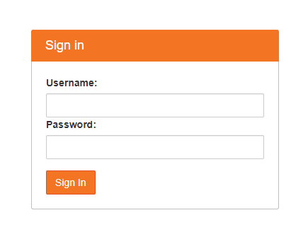
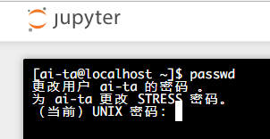
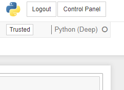
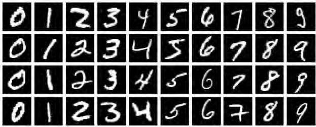
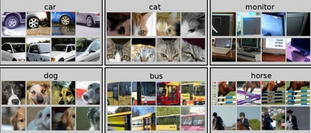
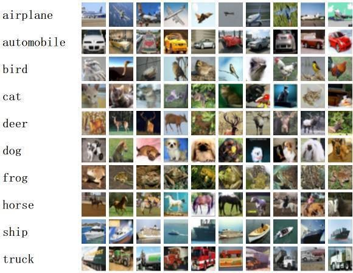

# 人工智能原理课程实习

<!-- TOC -->

- [人工智能原理课程实习](#人工智能原理课程实习)
    - [零、参考文档](#零参考文档)
    - [一、系统登录和密码修改](#一系统登录和密码修改)
    - [**二、有关GPU的注意事项（很重要）**](#二有关gpu的注意事项很重要)
        - [1.设定GPU显存为自增长模式](#1设定gpu显存为自增长模式)
        - [2.释放GPU内存](#2释放gpu内存)
    - [三、课程实习题目](#三课程实习题目)
        - [1. 图像语义生成](#1-图像语义生成)
            - [1.1 MNIST（图像分类）](#11-mnist图像分类)
            - [1.2 PASCAL VOC（图像标注）](#12-pascal-voc图像标注)
            - [1.3 CIFAR（图像分类）](#13-cifar图像分类)
            - [1.4 COCO（图像语义分析）](#14-coco图像语义分析)
        - [2. 推荐系统](#2-推荐系统)
            - [2.1 电影数据集-Movielen](#21-电影数据集-movielen)
        - [3.舆情分析](#3舆情分析)
        - [4.跨媒体检索](#4跨媒体检索)
    - [四、实习报告格式](#四实习报告格式)
    - [五、实验指导材料](#五实验指导材料)

<!-- /TOC -->

## 零、参考文档

1. [Keras 2.0.8](https://faroit.github.io/keras-docs/2.0.8/)
    - [Datasets](https://faroit.github.io/keras-docs/2.0.8/datasets/)
    - [Examples](https://github.com/keras-team/keras/tree/master/examples)
1. [CS228 Python Tutorial](http://nbviewer.jupyter.org/github/kuleshov/cs228-material/blob/master/tutorials/python/cs228-python-tutorial.ipynb)
1. [Data science Python notebooks](https://github.com/donnemartin/data-science-ipython-notebooks)
    - [Keras part](https://github.com/donnemartin/data-science-ipython-notebooks/tree/master/deep-learning/keras-tutorial)

## 一、系统登录和密码修改

1. 登录系统，访问邮件中给出的地址，在登录界面上输入自己组的用户名密码



2. 进入JupyterHub后，点击页面右上角`New`->`Terminal`


3. 在打开的终端输入命令,按照提示修改密码：

``` sh
passwd
```



4. 点击右上角的logout，然后用新修改的密码重新登录系统


## **二、有关GPU的注意事项（很重要）**

### 1.设定GPU显存为自增长模式

Tensorflow默认会占用GPU的全部显存，如果不对显存进行一些设定，当一个人完全占用了GPU之后，其他同学将无法正常使用GPU资源。

使用Tensorflow：

``` python
import os
os.environ["CUDA_VISIBLE_DEVICES"]="0"  # Only use GPU:0

import tensorflow as tf

config = tf.ConfigProto()
config.gpu_options.allow_growth = True

# Graph ...
x = tf.add(3, 4)

# Run
with tf.Session(config=config) as sess:
    sess.run(x)
```

使用Keras：

``` python
import os
os.environ["CUDA_VISIBLE_DEVICES"]="0"  # Only use GPU:0

import tensorflow as tf
from keras import backend as K

config = tf.ConfigProto()
config.gpu_options.allow_growth = True
session = tf.Session(config=config)
K.set_session(session)

# ...
```

使用其他框架或者不使用jupyter notebook的同学也请注意同样的问题。

### 2.释放GPU内存

**上机结束后一定要关闭自己的Server/打开的notebook，或者关闭自己的程序，释放GPU内存！**

1. Stop My Server 

点击右上角的`Control Panel`，然后在打开的页面中点击`Stop My Server`：




2. Shutdown kernel

在目录里选择打开的notebook，然后点击`Shutdown`


不使用jupyter notebook的同学也请注意同样的问题。


## 三、课程实习题目

### 1. 图像语义生成

**问题描述：** 基于深度学习方法的图像语义分析，包括图像分类、图像标注。

**常用数据集：**

#### 1.1 MNIST（图像分类）

MNIST是一个手写数字数据库，它有60000个训练样本集和10000个测试样本集，每个样本图像的宽高为28*28。



**链接：http://yann.lecun.com/exdb/mnist/index.html**

#### 1.2 PASCAL VOC（图像标注）



PASCAL VOC挑战赛是视觉对象的分类识别和检测的一个基准测试，提供了检测算法和学习性能的标准图像注释数据集和标准的评估系统。PASCAL VOC图片集包括20个目录：人类；动物（鸟、猫、牛、狗、马、羊）；交通工具（飞机、自行车、船、公共汽车、小轿车、摩托车、火车）；室内（瓶子、椅子、餐桌、盆栽植物、沙发、电视）。PASCAL VOC挑战赛在2012年后便不再举办，但其数据集图像质量好，标注完备，非常适合用来测试算法性能。

数据集大小：~2GB

**下载地址：http://host.robots.ox.ac.uk/pascal/VOC/voc2012/index.html**

#### 1.3 CIFAR（图像分类）



CIFAR-10包含10个类别，50,000个训练图像，彩色图像大小：32x32，10,000个测试图像。CIFAR-100与CIFAR-10类似，包含100个类，每类有600张图片，其中500张用于训练，100张用于测试；这100个类分组成20个超类。图像类别均有明确标注。CIFAR对于图像分类算法测试来说是一个非常不错的中小规模数据集。

数据集大小：~170MB

**下载地址：http://www.cs.toronto.edu/~kriz/cifar.html**

#### 1.4 COCO（图像语义分析）


COCO (Common Objects in Context) 是一个新的图像识别、分割和图像语义数据集，它有如下特点：
1. Object segmentation
1. Recognition in Context
1. Multiple objects per image
1. More than 300,000 images
1. More than 2 Million instances
1. 80 object categories
1. 5 captions per image
1. Keypoints on 100,000 people

COCO数据集由微软赞助，其对于图像的标注信息不仅有类别、位置信息，还有对图像的语义文本描述，COCO数据集的开源使得近两三年来图像分割语义理解取得了巨大的进展，也几乎成为了图像语义理解算法性能评价的“标准”数据集。

数据集大小：~40GB

**下载地址：http://mscoco.org/**

### 2. 推荐系统

**问题描述：** 推荐系统是利用电子商务网站向客户提供商品信息和建议，帮助用户决定应该购买什么产品，模拟销售人员帮助客户完成购买过程。个性化推荐是根据用户的兴趣特点和购买行为，向用户推荐用户感兴趣的信息和商品。

#### 2.1 电影数据集-Movielen

GroupLens Research（http://www.grouplens.org/node/73）采集了一组从20世纪90年末到21世纪初由MovieLens用户提供的电影评分数据。这些数据中包括电影评分、电影元数据（风格类型和年代）以及关于用户的人口统计学数据（年龄、邮编、性别和职业等）。

**下载地址: https://grouplens.org/datasets/movielens/**

### 3.舆情分析

**问题描述：** 舆情分析就是根据特定问题的需要，针对这个问题的舆情进行深层次的思维加工和分析研究，得到相关结论的过程。

### 4.跨媒体检索

**问题描述：** 跨媒体语义检索是文本、图像等检索领域中的一个前沿研究方向。由于文本、图像等不同媒体底层特征是异构的，并且与高层语义存在语义鸿沟，媒体检索时无法有效地实现从内容到用户查询语义的映射。而跨媒体语义检索旨在研究利用机器学习多种媒体的语义，实现从一种媒体向另一种媒体跨越式的语义检索

## 四、实习报告格式

1. 实验目的
1. 规格说明
1. 算法步骤
1. 结果分析
1. 实验体会
1. 结束语
1. 参考文献
1. 实习建议

## 五、实验指导材料

- [Notebook used in tensorflow course](https://github.com/silverHugh/ai-course/blob/master/tensorflow_class.ipynb) [\[nbviewer\]](http://nbviewer.jupyter.org/github/silverHugh/ai-course/blob/master/tensorflow_class.ipynb)
- [Tensorflow and Keras 安装.docx](https://github.com/silverHugh/ai-course/blob/master/Tensorflow%20and%20Keras%20%E5%AE%89%E8%A3%85.docx)
- [tf_case.py](https://github.com/silverHugh/ai-course/blob/master/tf_case.py)
- [keras_case.py](https://github.com/silverHugh/ai-course/blob/master/keras_case.py)
